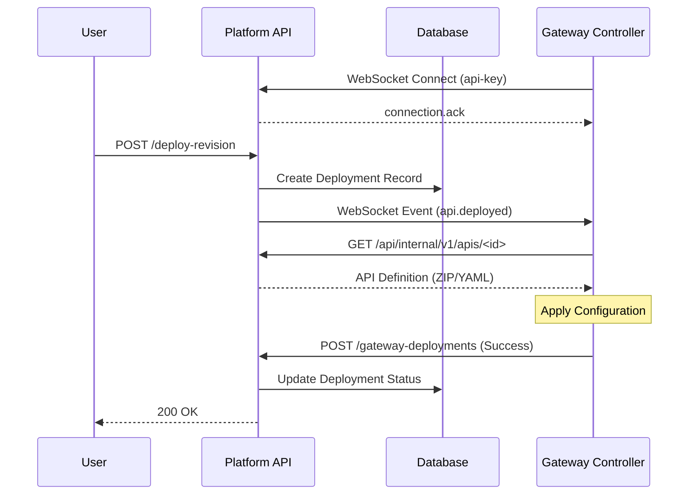

# API Deployment Architecture

This document explains the architecture and workflow for deploying APIs from the Platform API to the Gateway.

## Overview

The API deployment process follows a "Push" model where the Platform API notifies the Gateway of new deployments via a WebSocket connection. The Gateway then fetches the API definition and applies it.

**Key Components:**
*   **Platform API**: Manages API metadata, lifecycle, and deployments.
*   **Gateway Controller**: The control plane of the Gateway that manages the runtime configuration.
*   **WebSocket Service**: Facilitates real-time communication between the Platform and the Gateway.

## Deployment Workflow

The following sequence describes the end-to-end flow when a user triggers an API deployment.

### 1. Gateway Connection
Before any deployment can happen, the Gateway must be connected to the Platform.

1.  **Connect**: The Gateway initiates a WebSocket connection to the Platform API.
    *   **URL**: `wss://<platform-host>/api/internal/v1/ws/gateways/connect`
    *   **Auth**: The Gateway sends its `api-key` in the HTTP headers.
2.  **Registration**: The Platform API validates the key and registers the connection in its `WebSocket Manager`.
3.  **Acknowledgment**: The Platform sends a `connection.ack` message to the Gateway.

### 2. Deployment Trigger
A user (or system) initiates a deployment via the Platform API REST interface.

*   **Endpoint**: `POST /api/v1/apis/<api-uuid>/deploy-revision?revisionId=<revision-uuid>`
*   **Handler**: `APIHandler.DeployAPIRevision` (in Platform API)

### 3. Platform Processing
Upon receiving the deployment request, the Platform API performs the following:

1.  **Validation**: Validates the request and ensures the Gateway exists and is authorized.
2.  **Association**: Creates an association record between the API and the Gateway if one doesn't exist.
3.  **Record Creation**: Creates an `APIDeployment` record in the database.
4.  **Event Broadcast**: The `GatewayEventsService` constructs a deployment event and sends it to the specific Gateway via the active WebSocket connection.

**Event Payload (`api.deployed`):**
```json
{
  "type": "api.deployed",
  "payload": {
    "apiId": "<api-uuid>",
    "revisionId": "<revision-uuid>",
    "vhost": "<virtual-host>",
    "environment": "production"
  },
  "timestamp": "2023-10-27T10:00:00Z",
  "correlationId": "<uuid>"
}
```

### 4. Gateway Processing
The Gateway Controller receives the `api.deployed` event and processes it:

1.  **Receive Event**: The WebSocket client in the Gateway receives the message.
2.  **Fetch Definition**: The Gateway calls the Platform API to download the full API definition.
    *   **Endpoint**: `GET /api/internal/v1/apis/<api-uuid>`
    *   **Format**: A ZIP file containing the API YAML configuration.
3.  **Extract & Parse**: The Gateway extracts the YAML from the ZIP file.
4.  **Apply Configuration**: The `APIDeploymentService` (in Gateway) applies the configuration to the data plane (e.g., Envoy).

### 5. Deployment Notification
Once the API is successfully deployed on the Gateway, it notifies the Platform API.

1.  **Notify**: The Gateway sends a confirmation request to the Platform API.
    *   **Endpoint**: `POST /api/internal/v1/apis/<api-uuid>/gateway-deployments`
    *   **Payload**: Contains status `DEPLOYED` and metadata.
2.  **Update Status**: The Platform API updates the deployment status in its database.

## Summary Diagram


